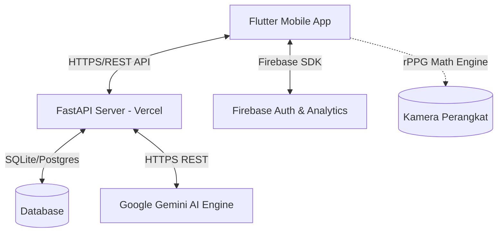

# Peaceful Mind 🌸
> **A Mindfulness & Mental Wellness Application**
>
> Peaceful Mind adalah aplikasi kesehatan mental dan kesejahteraan diri berbasis mobile yang dirancang untuk membantu pengguna mengelola emosi, melacak jurnal harian, memantau tanda-tanda vital secara non-invasif, serta mendapatkan kenyamanan emosional melalui bantuan asisten AI dan rekomendasi makanan penenang (*Comfort Food*).

---

## 🚀 Fitur Utama

Aplikasi ini dilengkapi dengan fitur-fitur mutakhir untuk mendukung kesehatan mental Anda secara komprehensif:

### 1. 📸 Deteksi Mood & Vital Sign (rPPG Engine)
* **Real-time rPPG Extraction**: Memanfaatkan kamera depan perangkat untuk mengukur denyut jantung (BPM), variabilitas detak jantung (HRV), dan tingkat stres secara non-invasif melalui fluktuasi intensitas warna hijau (*green channel*) di pembuluh darah kapiler wajah.
* **Dual-Mode System**:
  * **Circadify API Mode**: Mengirimkan data fisiologis tingkat lanjut ke REST API Circadify jika kredensial terkonfigurasi.
  * **Local rPPG Math Engine (Fallback)**: Memproses sinyal denyut nadi secara lokal di perangkat dengan algoritma matematika (detrending, smoothing, peak detection) sehingga privasi terjamin 100% dan dapat berfungsi secara offline.
* **Anti-Fake & Anti-Object Validation**: Dilengkapi sensor kualitas sinyal. Mencegah pemindaian palsu pada permukaan datar (seperti tangan) atau benda mati dengan menganalisis standar deviasi kontras spasial (*luminance*) dan keteraturan *Inter-Beat Interval* (IBI) (`stdDevIbi > 180ms` menandakan non-wajah/benda mati).

### 2. 🤖 AI Chatbot Asisten Curhat (Gemini AI)
* **Kecerdasan Dinamis**: Konseling pribadi yang ditenagai oleh Google Gemini API untuk mendengarkan keluh kesah pengguna dan memberikan tanggapan empati secara real-time.
* **Secure API Key Handling**: Kunci API disimpan secara aman di sisi backend (Vercel environment variables), sehingga tidak pernah terekspos di dalam aplikasi client.
* **Picu Comfort Food**: Asisten AI dapat mendeteksi emosi pengguna secara otomatis dan langsung merekomendasikan makanan penenang yang sesuai.

### 3. 🍲 Comfort Food & Integrasi Ojek Online / Maps
* **Rekomendasi Kuliner**: Menyajikan daftar makanan penenang berdasarkan kondisi emosional saat ini.
* **Mitra UMKM Terdekat**: Integrasi Google Maps API untuk memetakan 3 toko/UMKM terdekat yang menjual makanan tersebut lengkap dengan info rating, jarak, dan harga.
* **Peta Navigasi Native**: Menekan tombol peta akan membuka aplikasi Google Maps native di perangkat pengguna secara ringan dan stabil.
* **Order Cepat GoFood / GrabFood**: Menggunakan Chrome Custom Tabs (`LaunchMode.inAppBrowserView`) untuk membuka link pemesanan online secara hemat RAM dan mencegah emulator/hp crash.

### 4. 📝 Pencatatan Jurnal & Statistik Kemajuan
* **Jurnal Terpadu**: Catat pikiran, emosi, kategori aktivitas harian, dan simpan langsung ke database cloud backend.
* **Statistik Visual & Streak**: Grafik lingkaran (Donut Chart) pembagian emosi, tren HRV harian, tingkat stres rata-rata, serta pelacak streak harian untuk memotivasi latihan kesadaran diri (*mindfulness*).

### 5. 🔐 Autentikasi Real & Aman
* Terintegrasi penuh dengan **Firebase Auth** untuk pendaftaran akun baru (*Sign Up*) dan masuk (*Login*).
* Mendukung Email & Password, Google Sign-In, dan Apple Sign-In dengan autentikasi ID Token yang divalidasi langsung ke backend database FastAPI.

---

## 🛠️ Arsitektur Teknologi

Aplikasi ini dibangun menggunakan arsitektur modern berkinerja tinggi:



* **Frontend**: Flutter (Dart) - SDK `>=3.0.0 <4.0.0`
* **Backend**: FastAPI (Python 3.9+) - Dideploy secara publik di Vercel
* **Database**: SQLite/Postgresql terintegrasi SQL Alchemy
* **Layanan Cloud**: Firebase Authentication, Google AI Studio (Gemini)

---

## ⚙️ Cara Menjalankan Proyek (Setup Guide)

### 1. Prasyarat
* [Flutter SDK](https://docs.flutter.dev/get-started/install) terpasang di komputer Anda.
* [Python 3.9+](https://www.python.org/downloads/) untuk menjalankan backend secara lokal jika diperlukan.
* Android Studio / Xcode untuk kompilasi emulator atau perangkat fisik.

### 2. Sisi Backend (FastAPI)
Jika Anda ingin menjalankan backend secara lokal:
1. Masuk ke folder backend:
   ```bash
   cd promob-backend
   ```
2. Buat Virtual Environment dan aktifkan:
   ```bash
   python -m venv venv
   # Di Windows:
   .\venv\Scripts\activate
   # Di macOS/Linux:
   source venv/bin/activate
   ```
3. Pasang semua dependensi:
   ```bash
   pip install -r requirements.txt
   ```
4. Tambahkan berkas `.env` yang berisi kredensial:
   ```env
   GEMINI_API_KEY=kunci_api_gemini_anda
   CIRCADIFY_API_KEY=kunci_api_circadify_opsional
   ```
5. Jalankan server lokal:
   ```bash
   uvicorn main:app --reload
   ```

### 3. Sisi Frontend (Flutter App)
1. Buka folder root proyek Flutter.
2. Unduh file konfigurasi Firebase `google-services.json` dari Firebase Console Anda dan tempatkan di direktori:
   * `android/app/google-services.json`
3. Ambil seluruh paket Flutter:
   ```bash
   flutter pub get
   ```
4. Jalankan aplikasi di emulator atau perangkat terhubung:
   ```bash
   flutter run
   ```

---

## 📦 Kompilasi & Deployment

### 📱 Build Android (APK)
Untuk membangun paket APK release guna keperluan pengujian di perangkat Android:
```bash
flutter build apk --release
```
Berkas APK yang berhasil dikompilasi dapat ditemukan pada direktori:
`build/app/outputs/flutter-apk/app-release.apk`

### 🌐 Build Web (Static HTML)
Aplikasi ini mendukung platform Web sepenuhnya. Untuk mem-build versi web secara lokal:
```bash
flutter build web --release
```
Hasil file statis akan tersimpan di dalam direktori: `build/web/`

### 🚀 CI/CD Vercel Deployment (Auto-Update Web)
Untuk mengonline-kan aplikasi Web secara gratis dengan sistem pembaruan otomatis (CI/CD) via Vercel:
1. Buka [Vercel Dashboard](https://vercel.com/) dan buat **New Project**.
2. **Import** repositori GitHub ini (Pilih *Third-party Git URL* jika ini adalah repositori kolaborasi teman).
3. Pada halaman **Configure Project** (Build & Development Settings), atur menjadi:
   - **Framework Preset**: `Other`
   - **Build Command** *(Nyalakan Override)*:
     ```bash
     if [ -d "flutter" ]; then echo "Flutter exist"; else git clone https://github.com/flutter/flutter.git -b stable; fi && ./flutter/bin/flutter build web --release
     ```
   - **Output Directory** *(Nyalakan Override)*: `build/web`
4. Klik **Deploy**.

**Trik Khusus untuk Kolaborator (Forked Vercel Remote):**
Jika Vercel membuat duplikat (*fork*) repositori di akun pribadimu, kamu bisa menyetel Git di laptopmu agar proses *push* mengupdate kedua repositori sekaligus (repositori asli dan *website live*):
```bash
git remote add vercel https://github.com/akun_github_kamu/Promob-Kel-2-Ifat.git
```
Rutinitas *push* kamu menjadi:
```bash
git push               # Push ke repositori asli temanmu (origin)
git push vercel main   # Memicu Vercel untuk mengupdate website secara otomatis
```

---

## 📂 Struktur Berkas Penting

* `lib/main.dart` - Titik masuk aplikasi dan registrasi rute navigasi.
* `lib/services/auth_service.dart` - Logika integrasi Firebase Auth dan Backend login/signup.
* `lib/services/circadify_service.dart` - Implementasi API Circadify dan fallback rPPG Math Engine.
* `lib/screens/login_screen.dart` & `signup_screen.dart` - UI/UX halaman autentikasi pastel premium.
* `lib/screens/mood_detection_screen.dart` - Modul pemindaian rPPG, filter kontras spasial, dan validasi objek.
* `lib/screens/comfort_food_screen.dart` - Peta UMKM terdekat, webview GoFood/GrabFood, dan integrasi Google Maps.
* `lib/screens/ai_chat_screen.dart` - Konseling AI berbasis Gemini.
* `lib/screens/journal_screen.dart` & `stats_screen.dart` - Fitur jurnal harian dan visualisasi data mood.

---

## 👥 Kontributor
Proyek ini dikembangkan oleh **Kelompok 2 - Kelas Pemrograman Bergerak (Promob)**.
